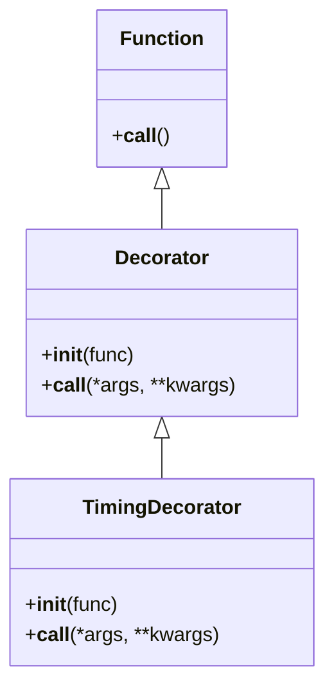

# Programación Orientada a Objetos - UNAL

## Clase 15: Generadores - Decoradores

## Generadores

Los generadores son una función especial en Python que permiten iterar de forma eficiente y perezosa. En lugar de devolver todos los valores de una vez (como con return), los generadores producen valores uno a uno bajo demanda mediante la palabra clave yield. Cada vez que se invoca al generador, este devuelve un valor y pausa su ejecución, reanudándola en el siguiente yield.

```python 
def contador(n):
  while n > 0:
    yield n
    n -= 1

for num in contador(5):
  print(num)
```

### `yield`

La palabra clave yield convierte una función en un generador. A diferencia de return, no termina la ejecución de la función, sino que la suspende, recordando el estado para continuar posteriormente.

```python 
def generador_simple():
  yield 1
  yield 2
  yield 3

gen = generador_simple()
print(next(gen))  
print(next(gen))  
print(next(gen))  
```

### Conexión con iteradores
Un generador en Python es un tipo de iterador que implementa los métodos __iter__() y __next__() de forma automática al utilizar yield. Cada vez que se llama a next(), la ejecución continúa hasta encontrar el siguiente yield.

 ```mermaid
classDiagram
  class Generador {
    +__iter__()
    +__next__()
  }
  class FuncionesGeneradoras {
    +yield()
  }

  Generador --|> FuncionesGeneradoras
```

### Diferencias con funciones
| Característica  | Funciones  | Generadores  |
|---|---|---|
| **Retornar valores** | Devuelven todos los valores de una vez. | Producen los valores uno por uno |
| **Memoria**  | Necesitan mucho espacio en memoria si los datos son grandes. | Ahorra memoria porque no se almacena toda la secuencia |
| **Eficiencia**  | Tienen una ejecución más rápida en casos simples, pero son ineficientes para datos muy grandes o infinitos. | Son ideales para flujos de datos continuos o secuencias infinitas |

## Casos de uso

1. Secuencias Infinitas: Los generadores son ideales para crear secuencias infinitas sin consumir excesiva memoria. Un ejemplo es la generación de números naturales.

```python 
def numeros_naturales():
  n = 0
  while True:
    yield n
    n += 1

# Uso del generador
gen = numeros_naturales()
for i in range(10):
  print(next(gen))
```

2. Secuencias personalizadas: Los generadores pueden crear secuencias personalizadas, como la secuencia de Fibonacci, que crece exponencialmente.

```python 
def fibonacci():
  a, b = 0, 1
  while True:
    yield a
    a, b = b, a + b

# Ejemplo de uso
gen = fibonacci()
for _ in range(10):
  print(next(gen))
```

3. Manejo de Grandes Volúmenes de Datos: Cuando se manejan archivos o flujos de datos grandes, cargar todo en memoria puede ser ineficiente. Los generadores permiten procesar línea por línea.

```python 
def leer_archivo_grande(ruta):
  with open(ruta) as archivo:
    for linea in archivo:
      yield linea

# Ejemplo de uso
for linea in leer_archivo_grande('mbox.txt'):
  print(linea.strip())
```

4. Generación de datos sinteticos: Los generadores pueden ser útiles para generar grandes cantidades de datos sintéticos, como datos de usuario.

```python 
import random

def generar_datos_usuarios(num_usuarios):
  nombres = ['Juan', 'Ana', 'Alicia', 'Roberto']
  apellidos = ['Pérez', 'García', 'Rodríguez', 'López']
  for _ in range(num_usuarios):
    yield {
      'nombre': random.choice(nombres),
      'apellido': random.choice(apellidos),
      'edad': random.randint(18, 70)
    }

# Generar y mostrar datos de 100 usuarios
for usuario in generar_datos_usuarios(100):
  print(usuario)
```

**Fuentes:**
 + [Understanding Generators in Python with Code Examples](https://medium.com/@siladityaghosh/understanding-generators-in-python-with-code-examples-9a139fc196b6)
 + [Understanding Python Generators: For Complete Beginners](https://medium.com/@abdulrehmanrizwan81/understanding-python-generators-for-complete-beginners-6a6973887a29)
 + [Python Generators — .send() And “x = yield” Explained in 240 Seconds](https://levelup.gitconnected.com/python-generators-send-and-x-yield-explained-in-240-seconds-6d71985b3381)
 + Python 3 Object Oriented Programming - Chap 9.


## Decoradores

Los decoradores en Python son una herramienta poderosa para modificar o extender la funcionalidad de funciones o métodos sin alterar su código original. Implementan el patrón de diseño decorador, que permite añadir comportamiento adicional a objetos de manera dinámica.

### Closures
Un closure (o clausura) es una técnica que permite que una función recuerde el entorno en el que fue creada, incluso después de que la función externa haya terminado su ejecución. Los decoradores en Python a menudo se basan en closures para mantener el estado y el contexto.

```python 
def decorator(func):
  def wrapper(*args, **kwargs):
    print(f"Arguments: {args}, {kwargs}")
    return func(*args, **kwargs)
  return wrapper

@decorator
def say_hello(name):
  print(f"Hello, {name}")

say_hello("Alice")
```

### Funciones revisted (como por cuarta vez)
En Python, las funciones pueden ser pasadas como argumentos a otras funciones. Esto es fundamental para los decoradores, que toman una función como argumento y devuelven una nueva función que envuelve la original.

```python 
# concepto basico de closure
def create_adder(base_number):
  print("Before returning the function")
  def adder(number):
    return base_number + number
  print("After returning the function")
  return adder

add_five = create_adder(5)
print(add_five(3)) 
```

```python 
def wrapper(func):
  def inner(*args, **kwargs):
    print("Before calling function")
    result = func(*args, **kwargs)
    print("After calling function")
    return result
  return inner

@wrapper
def add(a, b):
  return a + b

print(add(2, 3))
```


### Definción (formal)
Un decorador es una función que toma otra función y le añade algún comportamiento adicional. El decorador devuelve una nueva función que envuelve a la original.

**Ejemplo:** Decorador de Temporización

```python 
import time

def timing_decorator(func):
  def wrapper(*args, **kwargs):
    start_time = time.time()
    result = func(*args, **kwargs)
    end_time = time.time()
    print(f"Execution time: {end_time - start_time:.4f} seconds")
    return result
  return wrapper

@timing_decorator
def slow_function(seconds):
  time.sleep(seconds)
  return "Done"

print(slow_function(2))
```



### Uso del `@`
El símbolo @ se utiliza en Python para aplicar decoradores de manera más legible y directa. Esto es un atajo que hace que el código sea más claro y conciso.

```python 
@timing_decorator
def example_function():
  pass
```

### Casos de Uso 

1. Validación de Entradas de Usuario: Los decoradores pueden ser usados para validar entradas antes de que una función procese los datos.

```python 
def validate_inputs(func):
  def wrapper(*args, **kwargs):
    if not all(isinstance(arg, int) for arg in args):
      raise ValueError("All arguments must be integers")
    return func(*args, **kwargs)
  return wrapper

@validate_inputs
def add_numbers(a, b):
  return a + b

print(add_numbers(1, 2))
```

2. Registro de Actividades: Los decoradores son útiles para registrar información sobre la ejecución de funciones.

```python 
def log_activity(func):
  def wrapper(*args, **kwargs):
    print(f"Executing {func.__name__} with arguments: {args}, {kwargs}")
    return func(*args, **kwargs)
  return wrapper

@log_activity
def process_data(data):
  return data.upper()

print(process_data("sample text"))
```

3. Autenticación de Usuarios: Se puede usar un decorador para verificar si un usuario tiene los permisos necesarios antes de ejecutar una función.

```python 
def require_login(func):
  def wrapper(user, *args, **kwargs):
    if not user.get('logged_in'):
      raise PermissionError("User must be logged in")
    return func(user, *args, **kwargs)
  return wrapper

@require_login
def access_resource(user):
  return "Resource accessed"

user = {'logged_in': True}
print(access_resource(user))
```

### Decoradores Comunes en Python

+ `@staticmethod`: Define un método que no recibe una referencia al objeto (self).

```python 
class MyClass:
  @staticmethod
  def static_method():
    return "Static method called"
```

+ `@classmethod`: Define un método que recibe una referencia a la clase (cls) en lugar de una instancia.

```python 
class MyClass:
  @classmethod
  def class_method(cls):
    return "Class method called"
```

+ `@property`: Define un método que puede ser accedido como un atributo.

```python 
class MyClass:
  @property
  def my_property(self):
    return "Property value"
```

+ `@functools.lru_cache`: Cachea los resultados de una función para mejorar la eficiencia.

```python 
from functools import lru_cache

@lru_cache(maxsize=None)
def expensive_function(x):
  return x ** 2
```

+ `@singledispatch`: Permite definir funciones sobrecargadas basadas en el tipo del primer argumento. Desde Python 3.4 en adelante.

```python 
from functools import singledispatch

@singledispatch
def process(value):
  return f"Processing {value}"

@process.register(int)
def _(value):
  return f"Processing integer {value}"

@process.register(str)
def _(value):
  return f"Processing string {value}"

print(process(10))    # Output: Processing integer 10
print(process("test"))  # Output: Processing string test
```

**Fuentes:**
 + [Python Decorators That Can Reduce Your Code By Half](https://medium.com/@ayush-thakur02/python-decorators-that-can-reduce-your-code-by-half-b19f673bc7d8)
 + [Mastering Python Decorators: A Comprehensive Guide for Enhancing Code Modularity and Functionality](https://medium.com/@ewho.ruth2014/mastering-python-decorators-a-comprehensive-guide-for-enhancing-code-modularity-and-818ae455260d)
 + [https://levelup.gitconnected.com/how-works-in-python-1f3ca1aac731](https://levelup.gitconnected.com/how-works-in-python-1f3ca1aac731)
 + [8 Python Decorator Things I Regret Not Knowing Earlier](https://levelup.gitconnected.com/8-python-decorator-things-i-regret-not-knowing-earlier-6e886619d75c)
 + Python 3 Object Oriented Programming - Chap 10.

## Reto 8
Be creative